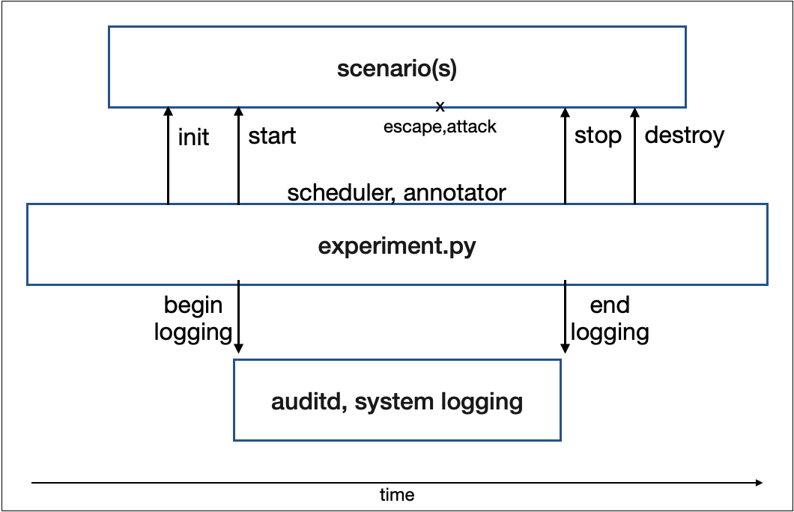

<h1 align="center">
  <a href="https://github.com/jpope8/container-escape-dataset">
    <!-- Please provide path to your logo here -->
    
  </a>
</h1>

<div align="center">
  Container Escape Detection for Edge Devices.
  <br />
  <a href="#basic-usage"><strong>Usage</strong></a> | <a href="#citing"><strong>Citing</strong></a>
  <br />
  <!--
  <br />
  <a href="https://github.com/jpope8/container-escape-dataset/issues/new?assignees=&labels=bug&template=01_BUG_REPORT.md&title=bug%3A+">Report a Bug</a>
  ·
  <a href="https://github.com/jpope8/container-escape-dataset/issues/new?assignees=&labels=enhancement&template=02_FEATURE_REQUEST.md&title=feat%3A+">Request a Feature</a>
  .
  <a href="https://github.com/jpope8/container-escape-dataset/issues/new?assignees=&labels=question&template=04_SUPPORT_QUESTION.md&title=support%3A+">Ask a Question</a>
  -->
</div>

<div align="center">
<br />

[](LICENSE)
[](https://github.com/jpope8/container-escape-dataset/issues?q=is%3Aissue+is%3Aopen+label%3A%22help+wanted%22)
[](https://github.com/jpope8)

</div>


## Contents

- [Introduction](#introduction)
- [Instructions](#instructions)
- [Generating](#Generating)
- [Citing](#citing)
- [License](#license)


---


## Introduction
This repository provides the following.

* Auditd datasets from edge devices with container escape scenarios
* Installation and instructions for generating new container escape datasets using a framework

The datasets can be downloaded [here](data).  The datasets are captured from both the [Umbrella](https://www.umbrellaiot.com/what-is-umbrella/umbrella-node/) edge device and a Linux Raspian VM.

To generate new container escape datasets continue with the below instructions.  Note that generating new datasets is restricted to using a Linux Raspian VM.

## Instructions

These installation instructions apply to creating a Linux Raspian virtual machine to act as the edge device to generate new datasets.  It is assumed that users are familiar with virtual machine technology (we have successfully used both Oracle Virtual Box and VMware Fusion).

Create a new virtual machine from a Raspian Buster iso image.  We used the 2021-01-11-raspios-buster-i386.iso image, though the instructions should also work for other Linux distributions.

https://downloads.raspberrypi.org/rpd_x86/images/rpd_x86-2021-01-12/2021-01-11-raspios-buster-i386.iso

Once the VM is running and logged in, the following software will need to be installed/configured.  The remaining instructions assume you are logged into the VM.  Open a terminal.  This should be the /home/pi directory.


### Install auditd
```bash
apt install auditd
```

### Install python3
Likely already installed.  Check, if not, install.
```bash
python --version (should be 3.7 or later)
apt install python3
```

### Install psutil (to generate system logs)
```bash
pip3 install psutil
```


### Install Docker
Install Docker using the standard Linux instructions.

https://docs.docker.com/engine/install/ubuntu/

Also setup docker to run without sudo.

https://docs.docker.com/engine/install/linux-postinstall/


### Install Docker-Compose

Install docker-compose using the standard instructions.

https://docs.docker.com/compose/install/


### Clone container-escape-dataset

Checkout the code using a git client.  Note that the directory structure includes containers/prometheus-grafana that is referenced by one of the framework's [scenario](./src/scenarioGrafana.py).  Other awesome-docker examples can be placed here and referenced similarly.

```bash
git clone https://github.com/jpope8/container-escape-dataset.git
```

### Check Setup
Once complete your home directory should look roughly as follows.

```bash
$ ls -la ./container-escape-dataset/
total 56
drwxr-xr-x  9 pi pi 4096 Sep 22 08:47 .
drwxr-xr-x 27 pi pi 4096 Sep 22 08:42 ..
drwxr-xr-x  2 pi pi 4096 Sep 22 08:47 data
drwxr-xr-x  3 pi pi 4096 Aug 29 16:33 docs
drwxr-xr-x  8 pi pi 4096 Sep 22 08:48 .git
-rw-r--r--  1 pi pi 1151 Sep 22 08:47 .gitattributes
-rw-r--r--  1 pi pi  654 Sep  9 14:43 .gitignore
drwxr-xr-x  2 pi pi 4096 Sep  9 14:43 images
-rw-r--r--  1 pi pi 1067 Aug 27 13:36 LICENSE
-rw-r--r--  1 pi pi 5905 Sep 22 08:47 README.md
drwxr-xr-x  2 pi pi 4096 Sep 16 12:18 rules
drwxr-xr-x  3 pi pi 4096 Sep 22 08:47 src
```

### Load the Escape Containers

Load both the denial of service and the privilege escape containers.

```bash
$ cd ./containers
$ docker load < umbrella_ubuntu_dos.tar.gz
$ docker load < umbrella_alpine_privesc.tar.gz
```
See [Containers](containers/README.md) for more information on how the containers were initially created.

## Generating

Change to the container-escape-dataset src directory and run the following command.  This will start a 1 minute experiment.  The grafana argument starts a grafana container and a prometheus container.  The dos argument starts a container that will randomly launch a denial of service attack during the experiment and write the time of the attack to the annotation file.

```bash
$ mkdir logs
$ cd ./container-escape-dataset/src
$ python experiment 1 ../../logs grafana dos
```

When the experiment completes, check the logs/experiments directory for the results of the experiment.  Example output should look as follows.

```bash
$ ls -ls ./logs/experiment/2021-09-16T122719/
total 17164
14420 -rw-r--r-- 1 pi   pi  14763097 Sep 16 12:42 2021-09-16T112722_system.log
 2736 -rw-r----- 1 root adm  2797216 Sep 16 12:42 2021-09-16T124223_audit.log
    4 -rw-r--r-- 1 pi   pi       212 Sep 16 12:35 annotated.txt
    4 -rw-r--r-- 1 pi   pi      3340 Sep 16 12:42 auditrules.txt
$
```
### Writing your own scenario

The following image shows the life cycle of a scenario being run with the framework.



It is relatively straight forward to implement a custom scenario.  Create a new python file (e.g. scenarioExample.py) and implement the following methods.  Only the getName method requires an implementation, the remaining method implementation depends on the user's requirements.  Several examples are provided [1](./src/scenarioGrafana.py), [2](./src/scenarioPrivesc.py), [3](./src/scenarioDos.py).

```python
class ScenarioExample:
    ...
    def getName(self):
        """
        Gets the name of the scenario.
        returns str
        """
    def init(self, scheduler, experimentSeconds, annotationFile):
        """
        Setup any resources for the scenario.
        Logging is not active.
        """
    def start(self):
        """
        May be called multiple times during experiment.
        Logging is active.
        """
    def stop(self):
        """
        May be called multiple times during experiment.
        Logging is active.
        """
    def destroy(self):
        """
        Tears down the scenario, for example, stop container.
        Logging is not active
        """
```

### Running your own scenario(s)

Once implemented, the scenario can be passed to the experiment to run the single scenario.  Experiments can also be run with multiple scenarios using the ScenarioComposite.  The following example.py shows the code to run multple scenarios.

```python
#
# Example main function
#
from scenarioExample import ScenarioExample
from scenarioGrafana import ScenarioGrafana
from scenarioComposite import ScenarioComposite
from experiment import Experiment
def main():
    seconds     = 15*60 # run for 15 minutes
    logDir      = '../../logs'
    scenarios = ScenarioComposite()
    scenarios.add( ScenarioGrafana() )
    scenarios.add( ScenarioExample() )
    experiment = Experiment( seconds, logDir, scenarios )
    experiment.run()
if __name__ == '__main__':
    main()
```
Open a terminal, change to the src directory, and run the experiment.

```bash
$ cd container-escape-dataset/src/
$ python3 experiment.py
```


Buena Suerte.


## Citing

Regarding the framework and dataset, please cite the following (the paper has been submitted and is under review, acceptance pending).

    @inproceedings{TBD,
      author = {Pope, James},
      title = {Dataset: Auditd data for Container Escape on Edge Devices},
      year = {2021}
    }

## References
> - [1] This work was supported by UK Research and Innovation, Innovate
UK [grant number 53707].  SYNERGIA - Secure bY desigN End to end platfoRm for larGe scale resource constrained Iot Applications. [InnovateUK](https://gtr.ukri.org/projects?ref=53707) (last retrieved September 2021).

## License

This project is licensed under the **MIT License**.

See [LICENSE](LICENSE) for more information.
