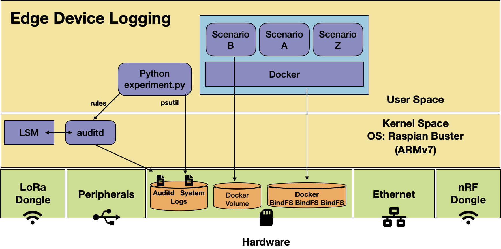

<h1 align="center">
  <a href="https://github.com/jpope8/container-escape-dataset">
    <!-- Please provide path to your logo here -->
    
  </a>
</h1>

<div align="center">
  Auditd Dataset for Container Escape.
  <br />
  <a href="#basic-usage"><strong>Usage</strong></a> | <a href="#citing"><strong>Citing</strong></a>
  <br />
  <!--
  <br />
  <a href="https://github.com/jpope8/container-escape-dataset/issues/new?assignees=&labels=bug&template=01_BUG_REPORT.md&title=bug%3A+">Report a Bug</a>
  ·
  <a href="https://github.com/jpope8/container-escape-dataset/issues/new?assignees=&labels=enhancement&template=02_FEATURE_REQUEST.md&title=feat%3A+">Request a Feature</a>
  .
  <a href="https://github.com/jpope8/container-escape-dataset/issues/new?assignees=&labels=question&template=04_SUPPORT_QUESTION.md&title=support%3A+">Ask a Question</a>
  -->
</div>

<div align="center">
<br />

[](LICENSE)
[](https://github.com/jpope8/container-escape-dataset/issues?q=is%3Aissue+is%3Aopen+label%3A%22help+wanted%22)
[](https://github.com/jpope8)

</div>

# UNDER CONSTRUCTION

## Contents

- [Introduction](#introduction)
- [Installation](#installation)
- [Dependencies](#dependencies)
- [Generating](#Generating)
- [Citing](#citing)
- [License](#license)


---


## Introduction
Dataset from Linux Raspian VMs and devices with auditd logs capturing various container escape and attacks.


## Installation

These installation instructions apply to creating the virtual machine to act as the edge device to generate new datasets.  It is assumed that users are familiar with virtual machine technology (we have successfully used both Oracle Virtual Box and VMware Fusion).

Create a new virtual machine from a Raspian Buster iso image.  We used the 2021-01-11-raspios-buster-i386.iso image, though the instructions should also work for other Linux distributions.

[https://downloads.raspberrypi.org/rpd_x86/images/rpd_x86-2021-01-12/2021-01-11-raspios-buster-i386.iso]

Once the VM is running and logged in, the following software will need to be installed/configured.  Open a terminal.  This should be the /home/pi directory.  Unless noted otherwise, the remaining instructions assume this is the directory installation commands are executed from.


### Install auditd
```bash
apt install auditd
```

### Install python3
Likely already installed.  Check, if not, install.
```bash
python --version (should be 3.5 or later)
apt install python3
```

### Install psutil (to generate system logs)
```bash
pip3 install psutil
```


### Docker Configuration
Install Docker using the standard Linux instructions.

[https://docs.docker.com/engine/install/ubuntu/]

Also setup docker to run without sudo.

[https://docs.docker.com/engine/install/linux-postinstall/]

A common networking problem can occur when running a docker container in a virtual machine.  The host can access the network (via NAT) but any container network access fails.  Specifically, running 'apt-get update' fails with 'Could not resolve 'archive.ubuntu.com'.


### Docker-Compose Configuration

Docker compose was also installed using the standard instructions.

[https://docs.docker.com/compose/install/]

Then awesome-docker was checked out using git.

[https://github.com/docker/awesome-compose]


### Install container-escape-dataset

Checkout the code using a git client.

```bash
git clone https://github.com/jpope8/container-escape-dataset.git
```

### Check Setup
Once complete your home directory should look roughly as follows.  Note that the container-escape-dataset and awesome-compose directories should be at the same level (the experiments use a relative directory to find the awesome-compose examples).

```bash
pi@raspberry:~ $ pwd
/home/pi
pi@raspberry:~ $ ls
awesome-compose
Bookshelf
container-escape-dataset
Desktop
Documents
Downloads
Music
Pictures
psutil
Public
Templates
Videos
```


## Generating

Change to the container-escape-dataset src directory and run the following command.  This will start a 1 minute experiment.  The graphana argument starts a graphana container and a prometheus container.  The dos argument starts a container that will randomly launch a denial of service attack during the experiment and write the time of the attack to the annotation file.

```bash
mkdir logs
cd ./container-escape-dataset/src
python experiment 1 ../../logs grafana dos
```

When the experiment completes, check the logs/experiments directory for the results of the experiment.  Example output should look as follows.

```bash
pi@raspberry:~ $ ls -ls ./logs/experiment/2021-09-16T122719/
total 17164
14420 -rw-r--r-- 1 pi   pi  14763097 Sep 16 12:42 2021-09-16T112722_system.log
 2736 -rw-r----- 1 root adm  2797216 Sep 16 12:42 2021-09-16T124223_audit.log
    4 -rw-r--r-- 1 pi   pi       212 Sep 16 12:35 annotated.txt
    4 -rw-r--r-- 1 pi   pi      3340 Sep 16 12:42 auditrules.txt
pi@raspberry:~ $ 
```


Buena Suerte.


## Citing

Regarding the framework and dataset, please cite the following (the paper has been submitted and is under review, acceptance pending).

    @inproceedings{TBD,
      author = {Pope, James},
      title = {Dataset: Auditd data for Container Escape on Edge Devices},
      year = {2021}
    }

## References
> - [1] SYNERGIA - Secure bY desigN End to end platfoRm for larGe scale resource constrained Iot Applications. (last retrieved September 2021) [InnovateUK](https://gtr.ukri.org/projects?ref=53707).


## License

This project is licensed under the **MIT License**.

See [LICENSE](LICENSE) for more information.
